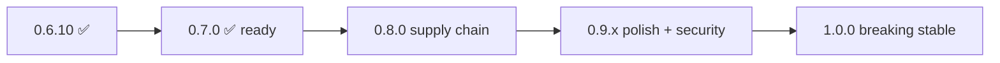

# pgwd roadmap

**Current release:** [v0.7.0](VERSION) (on `develop`; tag pending on `main`) · **Branch:** `develop` · **Target:** [v1.0.0](docs/plan-1.0.x.md) stable API (early–mid July 2026)

**Status (2026-07-03):** **v0.7.0** ready on `develop` (notifiers + retry). **Active band: 0.8.0 📋 next** (supply chain). Calendar below is aspirational — adjust if bands slip.

This file is the **single roadmap index**. Shipped behavior: [SPECIFICATIONS.md](SPECIFICATIONS.md) (v0.7.0). Shipped releases: [CHANGELOG.md](CHANGELOG.md). Implementation detail per band: [docs/plan-0.7.x.md](docs/plan-0.7.x.md) → [docs/plan-1.0.x.md](docs/plan-1.0.x.md).

---

## North star

**v1.0.0** — stable CLI, env, and YAML contract; deprecated flags and config keys removed; supply chain signed; operator docs audited. After 1.0, breaking changes require a **major** semver bump.

---

## Release line (0.6.10 → 1.0.0)

| Band | Status | Target | Theme | Plan |
|------|--------|--------|-------|------|
| **0.6.x** | ✅ Shipped | Jun 2026 | Metrics store, multi-DB, HTTP `/metrics`, CSV export, security patches | [CHANGELOG](CHANGELOG.md) |
| **0.7.x** | ✅ Ready (v0.7.0) | Jul 2026 | PagerDuty, Teams, generic webhook + JWT/HMAC, shared HTTP retry | [plan-0.7.x.md](docs/plan-0.7.x.md) · [CHANGELOG](CHANGELOG.md#070---2026-07-03) |
| **0.8.0** | 📋 Planned | Jun–Jul 2026 | Syft SBOM + Cosign keyless signing (GHCR + release artifacts) | [plan-0.8.x.md](docs/plan-0.8.x.md) |
| **0.9.x** | 📋 Planned | Jul 2026 | Pre-1.0 polish, **remove `DISCOVER_MY_PASSWORD`**, profiles, `--strict`, SPEC audit | [plan-0.9.x.md](docs/plan-0.9.x.md) |
| **1.0.0** | 📋 Planned | Early–mid Jul 2026 | Breaking stable API, deprecations removed | [plan-1.0.x.md](docs/plan-1.0.x.md) |

**Suggested calendar** (from band plans — **slip OK**; 0.7.x started 2026-07-02):

| Window | Milestone |
|--------|-----------|
| Jun 17 | v0.6.10 ✅ |
| Jul 3 | v0.7.0 ✅ (develop; tag on `main`) |
| Jun 25–30 | 0.8.0 |
| Jul 1–7 | 0.9.x |
| Jul 8–14 | 1.0.0 |

Each band: design → implement → test → `make release-check` → docs → tag from `main`.

---

## What each band delivers

### 0.7.x — notification channels

- **PagerDuty** Events API v2 (`routing_key`, severity mapping)
- **Microsoft Teams** incoming webhook
- **Generic webhook** — custom headers (JWT), HMAC, optional body template
- **Shared HTTP retry** with backoff (Slack/Loki migrate to same path)
- Config: YAML `notifications.pagerduty|teams|generic`, `PGWD_NOTIFICATIONS_*`, CLI flags

→ [plan-0.7.x.md](docs/plan-0.7.x.md)

### 0.8.0 — supply chain

- **Syft** SPDX SBOM on images and release artifacts
- **Cosign** keyless sign (GitHub OIDC), operator `cosign verify` docs
- CI/release pipeline aligned with [groot](https://github.com/hrodrig/groot) / [kzero](https://github.com/hrodrig/kzero)
- `make docker-scan` (Grype) still mandatory before release

→ [plan-0.8.x.md](docs/plan-0.8.x.md)

### 0.9.x — pre-1.0 polish and security

| Item | Notes |
|------|--------|
| **Remove `DISCOVER_MY_PASSWORD`** | Decision record: [docs/kubernetes-passwords.md](docs/kubernetes-passwords.md). Replace with Secret-backed URLs, wrapper script, `kube.password_from_secret` |
| **Config profiles** | `contrib/profiles/` (minimal-slack, daemon-loki, kube-prod, multi-db) |
| **`--strict`** | Optional exit 4 on notify delivery failure |
| **Coverage** | **`make cover-check`** ≥ 80% (library packages; homologated with kzero) |
| **Collector** | Opt-in anonymous daemon telemetry + opt-out update check (gghstats model) |
| **Deprecation runway** | Stronger warnings for legacy `db:` config |
| **SPEC audit** | [SPECIFICATIONS.md](SPECIFICATIONS.md) matches shipped 0.9 code |

→ [plan-0.9.x.md](docs/plan-0.9.x.md)

### 1.0.0 — breaking stable API

**Removed:**

| Surface | Replacement |
|---------|-------------|
| `-db-threshold-total` / `-db-threshold-active` | `-db-threshold-levels` (default `75,85,95`) |
| `-notify-on-connect-failure` | Always-on when notifiers configured |
| Config key `db:` | `databases:` (even for one target) |
| `DISCOVER_MY_PASSWORD` | Already gone in 0.9.x |

**Release gate:** 100+ tests ✅, [plan-0.8.x](docs/plan-0.8.x.md) supply chain shipped, `make release-check` green, man page + demo GIF synced.

→ [plan-1.0.x.md](docs/plan-1.0.x.md)

---

## Shipped history (0.4 → 0.7.0)

| Version | Date | Highlight |
|---------|------|-----------|
| 0.4.0 | Mar 2026 | Loki auth, kube-loki, Grafana org ID |
| 0.5.0 | Mar 2026 | Loki labels, security hardening |
| 0.6.0 | Apr 2026 | CSV export, multi-DB, SQLite store, HTTP `/metrics`, Helm → pgwd-selfhosted |
| 0.6.4 | May 2026 | PostgreSQL/MySQL metrics store |
| 0.6.5–0.6.8 | May–Jun 2026 | Security patches (Go, Alpine, govulncheck) |
| 0.6.9 | Jun 2026 | `--print-sample-config` |
| 0.6.10 | Jun 2026 | Docker Alpine 3.24.1 (CVE-2026-2673) |
| 0.7.0 | Jul 2026 | PagerDuty, Teams, generic webhook, HTTP retry |

Full detail: [CHANGELOG.md](CHANGELOG.md).

---

## Key decisions (stable across bands)

| Topic | Decision |
|-------|----------|
| **TimescaleDB** | Use existing `metrics_store.driver: postgres` — no dedicated backend |
| **Helm / Compose prod paths** | [pgwd-selfhosted](https://github.com/hrodrig/pgwd-selfhosted) — this repo ships binary, packages, image |
| **K8s passwords** | Deprecate `DISCOVER_MY_PASSWORD` (exec) → Secret-backed DSN — [kubernetes-passwords.md](docs/kubernetes-passwords.md) |
| **Multi-DB + kube** | `-kube-postgres` not supported with `databases:` until per-db kube exists (post-1.0) |
| **Connect failure alerts** | Always sent when notifiers configured (no extra flag) |

---

## Explicitly out of scope (through v1)

- Mutating Postgres (terminate, vacuum, alter)
- Built-in GUI / dashboard
- Multi-cluster from one process
- Notifier plugin system (compiled-in channels only)
- Replication lag monitoring

See [SPECIFICATIONS.md §2](SPECIFICATIONS.md#2-scope).

---

## Post-1.0 (ideas, not committed)

- Per-database `kube.postgres` in `databases:`
- Additional Prometheus series or OpenMetrics (today: text exposition on HTTP `/metrics`)
- Discord, email, additional channels via same notifier pattern as 0.7.x

Track via GitHub issues after 1.0.0.

---

## Document map

| Document | Role |
|----------|------|
| **ROADMAP.md** (this file) | Where we are, where we go, band index |
| **[SPECIFICATIONS.md](SPECIFICATIONS.md)** | Observable behavior contract for **shipped** code (v0.7.0); planned bands noted as deprecated/future only |
| **[CHANGELOG.md](CHANGELOG.md)** | What actually shipped per version |
| **[docs/plan-0.7.x.md](docs/plan-0.7.x.md) … [plan-1.0.x.md](docs/plan-1.0.x.md)** | Implementation checklists per band |
| **[docs/kubernetes-passwords.md](docs/kubernetes-passwords.md)** | Security decision: DISCOVER deprecation |
| **[docs/UPGRADE-0.5-to-0.6.md](docs/UPGRADE-0.5-to-0.6.md)** | Operator upgrade guide (0.5 → 0.6) |

When planning work: start here → open the band plan → update SPEC + CHANGELOG when behavior ships (docs-only changes stay in `[Unreleased]` until the band is tagged).
