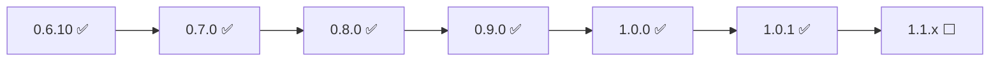

# pgwd roadmap

**Current release:** [v1.0.1](VERSION) (ready on `develop`; tag from `main` after `make release-check`) · **Branch:** `develop`

**Status (2026-08-09):** **v1.0.1** shipped. Next band: **1.1.x** incident hygiene (PagerDuty dedup/resolve + threshold anti-spam latch) — plan open, not implemented. Stable API remains **v1.0.0** (+ additive 1.1 keys). Distro packaging continues in **1.x** (not a hard tag gate).

This file is the **single roadmap index**. Shipped behavior: [SPECIFICATIONS.md](SPECIFICATIONS.md) (v1.0.0 contract; patch **v1.0.1**). Shipped releases: [CHANGELOG.md](CHANGELOG.md). Implementation detail per band: [docs/plan-0.7.x.md](docs/plan-0.7.x.md) → [docs/plan-1.0.x.md](docs/plan-1.0.x.md) → [docs/plan-1.1.x.md](docs/plan-1.1.x.md).

---

## North star

**v1.0.0** — stable CLI, env, and YAML contract; deprecated flags and config keys removed; supply chain signed; operator docs audited. After 1.0, breaking changes require a **major** semver bump.

---

## Release line (0.6.10 → 1.0.0)

| Band | Status | Target | Theme | Plan |
|------|--------|--------|-------|------|
| **0.6.x** | ✅ Shipped | Jun 2026 | Metrics store, multi-DB, HTTP `/metrics`, CSV export, security patches | [CHANGELOG](CHANGELOG.md) |
| **0.7.x** | ✅ Ready (v0.7.0) | Jul 2026 | PagerDuty, Teams, generic webhook + JWT/HMAC, shared HTTP retry | [plan-0.7.x.md](docs/plan-0.7.x.md) · [CHANGELOG](CHANGELOG.md#070---2026-07-03) |
| **0.8.0** | ✅ Ready (v0.8.0) | Jul 2026 | Syft SBOM + Cosign keyless signing (GHCR + release artifacts) | [plan-0.8.x.md](docs/plan-0.8.x.md) · [CHANGELOG](CHANGELOG.md#080---2026-07-11) |
| **0.9.x** | ✅ Ready (v0.9.0) | Jul 2026 | Pre-1.0 polish, DISCOVER removal, profiles, `--strict`, collector, SPEC audit | [plan-0.9.x.md](docs/plan-0.9.x.md) · [CHANGELOG](CHANGELOG.md#090---2026-07-13) |
| **1.0.0** | ✅ Ready (v1.0.0) | Jul 2026 | Breaking stable API, compare docs, **start official distro packaging** | [plan-1.0.x.md](docs/plan-1.0.x.md) · [CHANGELOG](CHANGELOG.md#100---2026-07-18) |
| **1.0.1** | ✅ Shipped | Aug 2026 | `golang.org/x/text` security bump + docs | [CHANGELOG](CHANGELOG.md#101---2026-08-01) |
| **1.1.x** | ⬜ Plan open | Aug–Sep 2026 | Incident hygiene: PagerDuty dedup/resolve + threshold anti-spam latch | [plan-1.1.x.md](docs/plan-1.1.x.md) |

**Suggested calendar** (from band plans — **slip OK**; 0.7.x started 2026-07-02):

| Window | Milestone |
|--------|-----------|
| Jun 17 | v0.6.10 ✅ |
| Jul 3 | v0.7.0 ✅ |
| Jul 11 | v0.8.0 ✅ |
| Jul 13 | v0.9.0 ✅ |
| Jul 18 | v1.0.0 ✅ |
| Aug 1 | v1.0.1 ✅ |
| Aug–Sep 2026 | v1.1.0 target (incident hygiene) |

Each band: design → implement → test → `make release-check` → docs → tag from `main`.

---

## What each band delivers

### 0.7.x — notification channels

- **PagerDuty** Events API v2 (`routing_key`, severity mapping)
- **Microsoft Teams** incoming webhook
- **Generic webhook** — custom headers (JWT), HMAC, optional body template
- **Shared HTTP retry** with backoff (Slack/Loki migrate to same path)
- Config: YAML `notifications.pagerduty|teams|generic`, `PGWD_NOTIFICATIONS_*`, CLI flags

→ [plan-0.7.x.md](docs/plan-0.7.x.md)

### 0.8.0 — supply chain

- **Syft** SPDX SBOM on images and release artifacts
- **Cosign** keyless sign (GitHub OIDC), operator `cosign verify` docs
- CI/release pipeline aligned with [groot](https://github.com/hrodrig/groot) / [kzero](https://github.com/hrodrig/kzero)
- `make docker-scan` (Grype) still mandatory before release

→ [plan-0.8.x.md](docs/plan-0.8.x.md)

### 0.9.x — pre-1.0 polish and security ✅ (v0.9.0)

| Item | Notes |
|------|--------|
| **Remove `DISCOVER_MY_PASSWORD`** ✅ | Decision record: [docs/kubernetes-passwords.md](docs/kubernetes-passwords.md). `kube.password_from_secret`, wrapper, RBAC sample |
| **Config profiles** ✅ | `contrib/profiles/` (minimal-slack, daemon-loki, kube-prod, multi-db) |
| **`--strict`** ✅ | Optional exit 4 on notify delivery failure |
| **Coverage** ✅ | **`make cover-check`** ≥ 80% (library packages) |
| **Collector** ✅ | Opt-in telemetry + opt-out update check → `collect.gghstats.com` |
| **Deprecation runway** ✅ | Stronger warnings for legacy `db:` config |
| **HTTP metrics privacy** ✅ | Optional `/metrics` token or basic auth |
| **Prometheus label escape** ✅ | Full label-value sanitization in `/metrics` exporter |
| **CSV export safety** ✅ | Prefix sanitization for spreadsheet formula injection |
| **Notifier TLS warning** ✅ | Log when Slack/Loki/Teams/generic URLs use `http://` (non-loopback) |
| **SPEC audit** ✅ | [SPECIFICATIONS.md](SPECIFICATIONS.md) baseline v0.9.0 |

→ [plan-0.9.x.md](docs/plan-0.9.x.md)

### 1.0.0 — breaking stable API + operator positioning ✅ (v1.0.0 ready)

**Removed:**

| Surface | Replacement |
|---------|-------------|
| `-db-threshold-total` / `-db-threshold-active` (CLI, env, YAML) | `-db-threshold-levels` (default `75,85,95`) |
| `-notify-on-connect-failure` / env / YAML | Always-on when notifiers configured |
| Config key `db:` | `databases:` (even for one target) |
| `DISCOVER_MY_PASSWORD` | Already gone in 0.9.x |

**Marketing / transparency (1.0 release gate):**

| Item | Notes |
|------|--------|
| **`docs/compare.md`** | pgwd vs common alternatives — honest matrix + “when to pick / when not pgwd” (pattern: [gfire/docs/compare.md](https://github.com/hrodrig/gfire/blob/main/docs/compare.md), [groot README § vs kubectl-gather](https://github.com/hrodrig/groot#groot-vs-kubectl-gather)) |
| **README § Compare** | Short at-a-glance table + link to full doc |
| **Landing `/compare`** | Mirror on [pgwd.hermesrodriguez.com](https://pgwd.hermesrodriguez.com) (app repo) for 1.0 announcement |
| **`docs/use-cases.md`** | Cross-link from compare doc (deployment scenarios already shipped in 0.9.x) |

**Distro packaging (1.x — start with v1.0.0; acceptance may land in later 1.x):**

Aim for **official** packages / ports (not only GitHub Releases / Homebrew tap / GoReleaser `.deb`/`.rpm`). Use existing **`contrib/`** port files as submission seeds where present.

| Target | Path |
|--------|------|
| **Debian** / **Ubuntu** | ITP + mentors; sync / universe once in Debian |
| **Fedora** | Package review → official repos |
| **Alpine** | aports (`apk`) |
| **FreeBSD** | Official ports tree (`contrib/freebsd` → Bugzilla) |
| **OpenBSD** | Official ports (`contrib/openbsd` → ports@) |
| **NetBSD** | pkgsrc |
| **DragonFly BSD** | DPorts (`contrib/dragonflybsd`) |
| **Others** | As demand appears (e.g. Arch AUR → community, openSUSE) |

Acceptance timelines are external (reviewers, freeze windows) — **not** a hard blocker for tagging **v1.0.0**; track progress in [plan-1.0.x.md](docs/plan-1.0.x.md) and GitHub issues.

**Candidates to compare** (verify upstream before each release): Prometheus **`postgres_exporter`** + Grafana/Alertmanager; **pgwatch** / pgwatch3; **hosted APM** (Datadog, New Relic); **cloud RDS/Cloud SQL** connection alarms; **cron + `psql`** / Nagios-style checks. pgwd is **not** a full metrics platform — position as a **read-only connection watchdog** with notifier + hysteresis out of the box.

**Release gate:** 100+ tests ✅, [plan-0.8.x](docs/plan-0.8.x.md) supply chain shipped, `make release-check` green, man page + demo GIF synced, **compare doc reviewed**.

→ [plan-1.0.x.md](docs/plan-1.0.x.md)

### 1.1.x — incident hygiene (on-call ready) ⬜

Theme from 2026-08-09 multi-auditor review: product gap is **sustained-outage noise**, not code craft.

| Item | Notes |
|------|--------|
| **PagerDuty `dedup_key` + `resolve`** | Stable key per target/problem; resolution uses `event_action: resolve` (not `trigger`+`info`) |
| **Threshold anti-spam latch** | Default: notify on transition / escalation / de-escalation only; escape hatch `notifications.repeat_while_firing` |
| **SPEC fix** | Known Limitations row wrongly claimed hysteresis covers interval repeats — correct when latch ships |
| **Doc drift (C5)** | README / OCI / nfpm one-liners: full notifier list (not “Slack/Loki” only) |

**Not in 1.1.x:** Dependabot, `slog`, cli split, per-DB kube, new channels — see Post-1.0 / later minors.

→ [plan-1.1.x.md](docs/plan-1.1.x.md)

---

## Shipped history (0.4 → 0.7.0)

| Version | Date | Highlight |
|---------|------|-----------|
| 0.4.0 | Mar 2026 | Loki auth, kube-loki, Grafana org ID |
| 0.5.0 | Mar 2026 | Loki labels, security hardening |
| 0.6.0 | Apr 2026 | CSV export, multi-DB, SQLite store, HTTP `/metrics`, Helm → pgwd-selfhosted |
| 0.6.4 | May 2026 | PostgreSQL/MySQL metrics store |
| 0.6.5–0.6.8 | May–Jun 2026 | Security patches (Go, Alpine, govulncheck) |
| 0.6.9 | Jun 2026 | `--print-sample-config` |
| 0.6.10 | Jun 2026 | Docker Alpine 3.24.1 (CVE-2026-2673) |
| 0.7.0 | Jul 2026 | PagerDuty, Teams, generic webhook, HTTP retry |
| 0.8.0 | Jul 2026 | Syft SBOM, Cosign signing, supply chain docs |
| 0.9.0 | Jul 2026 | DISCOVER removed, profiles, strict, collector, metrics/CSV hardening, operator docs |
| 1.0.0 | Jul 2026 | Stable API; compare/upgrade docs; distro packaging started |
| 1.0.1 | Aug 2026 | `golang.org/x/text` security bump |

Full detail: [CHANGELOG.md](CHANGELOG.md).

---

## Key decisions (stable across bands)

| Topic | Decision |
|-------|----------|
| **TimescaleDB** | Use existing `metrics_store.driver: postgres` — no dedicated backend |
| **Helm / Compose prod paths** | [pgwd-selfhosted](https://github.com/hrodrig/pgwd-selfhosted) — this repo ships binary, packages, image |
| **K8s passwords** | Deprecate `DISCOVER_MY_PASSWORD` (exec) → Secret-backed DSN — [kubernetes-passwords.md](docs/kubernetes-passwords.md) |
| **Multi-DB + kube** | `-kube-postgres` not supported with `databases:` until per-db kube exists (post-1.0) |
| **Connect failure alerts** | Always sent when notifiers configured (no extra flag) |
| **HTTP `/metrics` privacy** | Opt-in token/basic auth (0.9.x); default anonymous in-cluster scrape; operator controls bind/network |
| **Alert repeat (1.1.x)** | Default: transition/escalation/de-escalation only; `notifications.repeat_while_firing` restores per-interval spam |
| **PagerDuty incidents (1.1.x)** | Stable `dedup_key` + `resolve` on resolution (one connections incident per target) |

---

## Explicitly out of scope (through v1)

- Mutating Postgres (terminate, vacuum, alter)
- Built-in GUI / dashboard
- Multi-cluster from one process
- Notifier plugin system (compiled-in channels only)
- Replication lag monitoring

See [SPECIFICATIONS.md §2](SPECIFICATIONS.md#2-scope).

---

## Post-1.0 (ideas, not committed)

**Committed next:** [1.1.x incident hygiene](docs/plan-1.1.x.md) (dedup/resolve + latch).

Still ideas (not scheduled):

- Per-database `kube.postgres` in `databases:`
- Additional Prometheus series or OpenMetrics (today: text exposition on HTTP `/metrics`)
- Discord, email, additional channels via same notifier pattern as 0.7.x
- Structured logging (`slog`) — audit Band C
- Dependabot/Renovate + pin CI tool versions — audit Band B
- Finish / expand **official distro** coverage if any 1.x submissions still pending (see [plan-1.0.x.md](docs/plan-1.0.x.md) § Distro packaging)

Track via GitHub issues; promote to a band plan when scheduled.

---

## Document map

| Document | Role |
|----------|------|
| **ROADMAP.md** (this file) | Where we are, where we go, band index |
| **[SPECIFICATIONS.md](SPECIFICATIONS.md)** | Observable behavior contract for **shipped** code (v1.0.0) |
| **[CHANGELOG.md](CHANGELOG.md)** | What actually shipped per version |
| **[docs/plan-0.7.x.md](docs/plan-0.7.x.md) … [plan-1.1.x.md](docs/plan-1.1.x.md)** | Implementation checklists per band |
| **[docs/use-cases.md](docs/use-cases.md)** | Operator scenario matrix (single/multi DB, K8s, credentials) |
| **[docs/compare.md](docs/compare.md)** | pgwd vs postgres_exporter, pgwatch, hosted APM, cloud alarms, DIY cron |
| **[docs/kubernetes-passwords.md](docs/kubernetes-passwords.md)** | K8s credentials + DISCOVER migration |
| **[docs/UPGRADE-0.9-to-1.0.md](docs/UPGRADE-0.9-to-1.0.md)** | Operator upgrade guide (0.9 → 1.0 breaking removals) |
| **[docs/UPGRADE-0.5-to-0.6.md](docs/UPGRADE-0.5-to-0.6.md)** | Operator upgrade guide (0.5 → 0.6) |

When planning work: start here → open the band plan → update SPEC + CHANGELOG when behavior ships (docs-only changes stay in `[Unreleased]` until the band is tagged).
