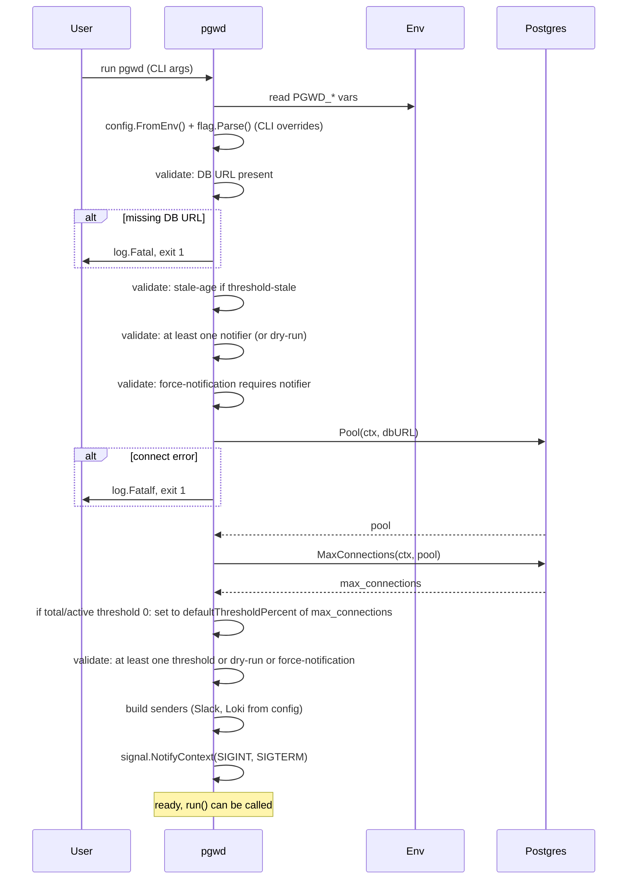

# Sequence: Startup and config validation

From process start until the first `run()` is invoked: load config, validate, connect to Postgres, apply default thresholds, build notifier senders.

```mermaid
sequenceDiagram
    participant User
    participant pgwd
    participant Env
    participant Postgres

    User->>pgwd: run pgwd (CLI args)
    pgwd->>Env: read PGWD_* vars
    pgwd->>pgwd: config.FromEnv() + flag.Parse() (CLI overrides)
    pgwd->>pgwd: validate: DB URL present
    alt missing DB URL
        pgwd->>User: log.Fatal, exit 1
    end
    pgwd->>pgwd: validate: stale-age if threshold-stale
    pgwd->>pgwd: validate: at least one notifier (or dry-run)
    pgwd->>pgwd: validate: force-notification requires notifier
    pgwd->>Postgres: Pool(ctx, dbURL)
    alt connect error
        pgwd->>User: log.Fatalf, exit 1
    end
    Postgres-->>pgwd: pool
    pgwd->>Postgres: MaxConnections(ctx, pool)
    Postgres-->>pgwd: max_connections
    pgwd->>pgwd: if total/active threshold 0: set to defaultThresholdPercent of max_connections
    pgwd->>pgwd: validate: at least one threshold or dry-run or force-notification
    pgwd->>pgwd: build senders (Slack, Loki from config)
    pgwd->>pgwd: signal.NotifyContext(SIGINT, SIGTERM)
    Note over pgwd: ready, run() can be called
```
