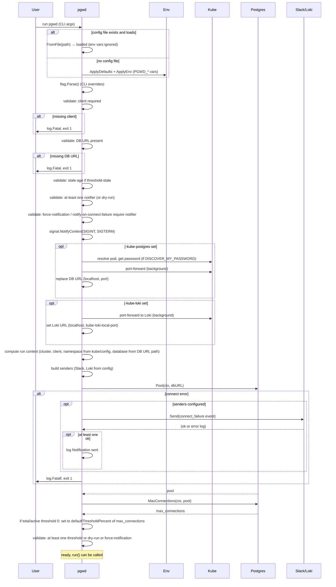

# Sequence: Startup and config validation

From process start until the first `run()` is invoked: load config, validate, optional Kubernetes port-forward, build senders, connect to Postgres, apply default thresholds.

