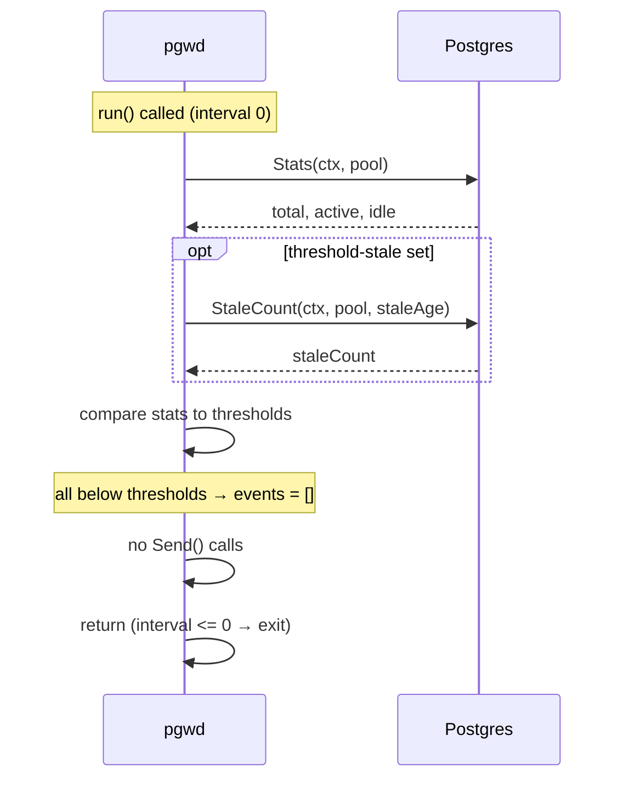

# Sequence: One-shot — no threshold exceeded, exit

Single run: fetch stats, no threshold exceeded, no events, exit without calling notifiers.

```mermaid
sequenceDiagram
    participant pgwd
    participant Postgres

    Note over pgwd: run() called (interval 0)
    pgwd->>Postgres: Stats(ctx, pool)
    Postgres-->>pgwd: total, active, idle
    opt threshold-stale set
        pgwd->>Postgres: StaleCount(ctx, pool, staleAge)
        Postgres-->>pgwd: staleCount
    end
    pgwd->>pgwd: compare stats to thresholds
    Note over pgwd: all below thresholds → events = []
    pgwd->>pgwd: no Send() calls
    pgwd->>pgwd: return (interval <= 0 → exit)
```
