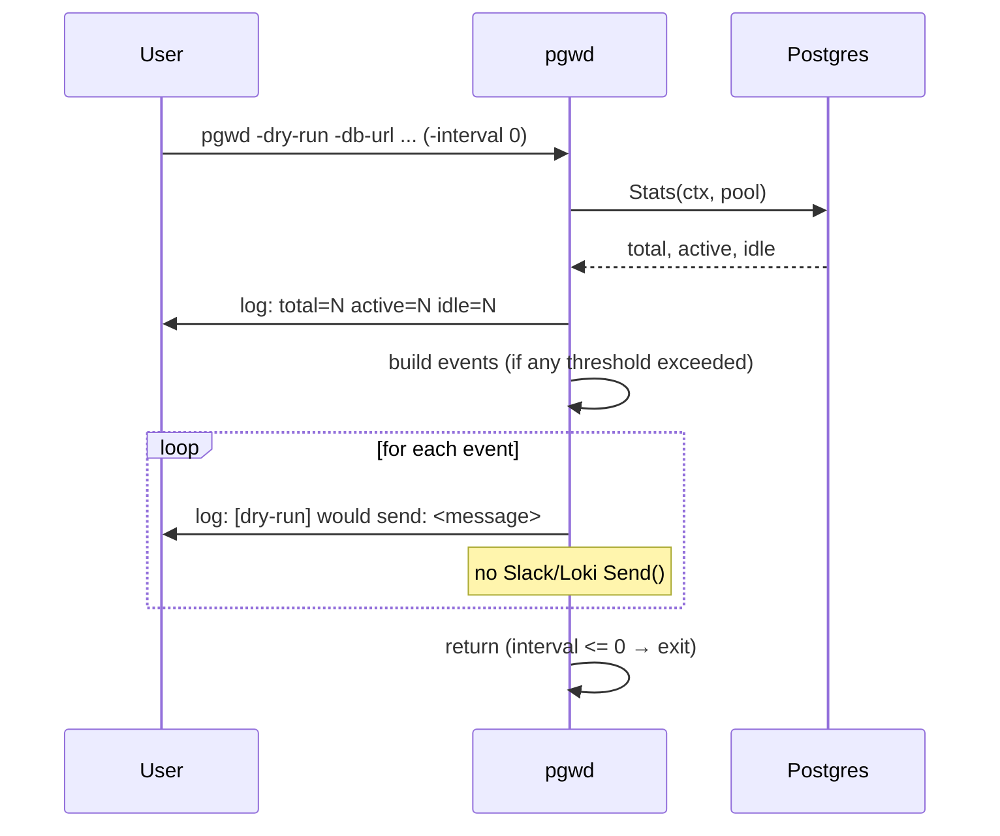

# Sequence: Dry-run — log stats only, no notifications

With `-dry-run`: fetch stats, log to stdout; for each would-be event log "[dry-run] would send: ..." and skip all HTTP calls to Slack/Loki.

```mermaid
sequenceDiagram
    participant User
    participant pgwd
    participant Postgres

    User->>pgwd: pgwd -dry-run -db-url ... (-interval 0)
    pgwd->>Postgres: Stats(ctx, pool)
    Postgres-->>pgwd: total, active, idle
    pgwd->>User: log: total=N active=N idle=N
    pgwd->>pgwd: build events (if any threshold exceeded)
    loop for each event
        pgwd->>User: log: [dry-run] would send: <message>
        Note over pgwd: no Slack/Loki Send()
    end
    pgwd->>pgwd: return (interval <= 0 → exit)
```
