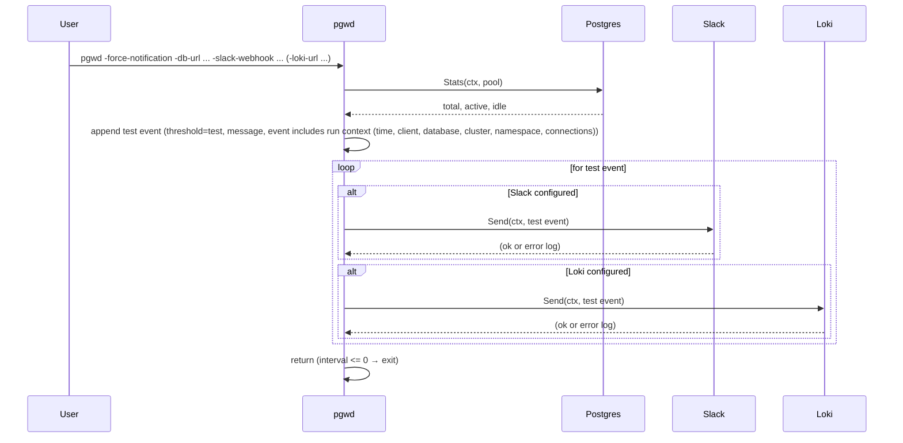

# Sequence: Force notification — test delivery

With `-force-notification`: when connected, fetch stats, add a single "test" event, send to all configured notifiers (Slack and/or Loki), then exit. When the connection to Postgres fails, a connect-failure event is sent instead (see [01-startup-validation](./01-startup-validation.md)). Used to validate webhook/URL and message format in both cases.

**Slack:** Message is sent as an attachment with color `good` (green bar) for test events; the body includes Time, Client, Database, Cluster, Namespace, and Connections as a bullet list.
