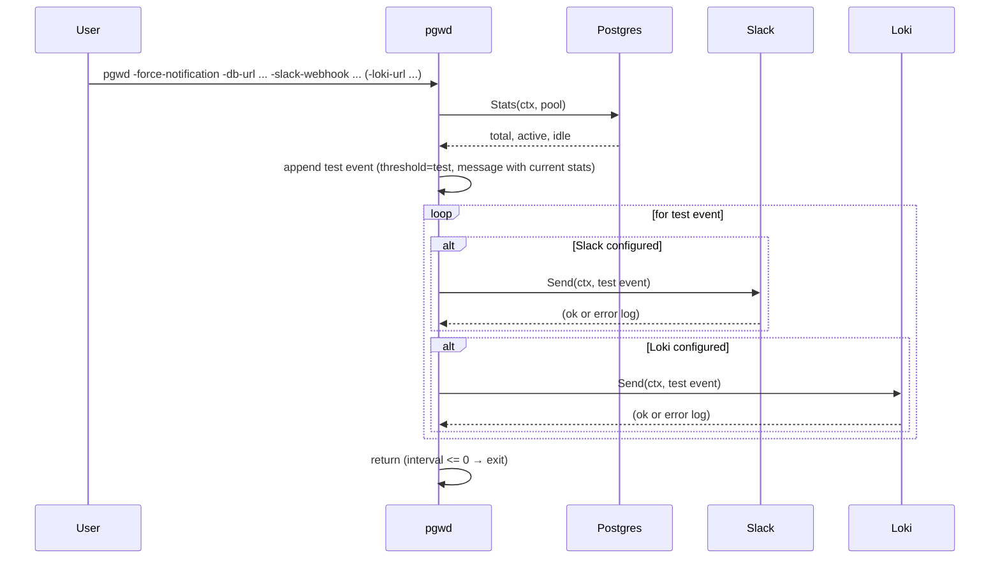

# Sequence: Force notification — test delivery

With `-force-notification`: fetch stats, add a single "test" event, send to all configured notifiers (Slack and/or Loki), then exit. Used to validate webhook/URL and message format.

