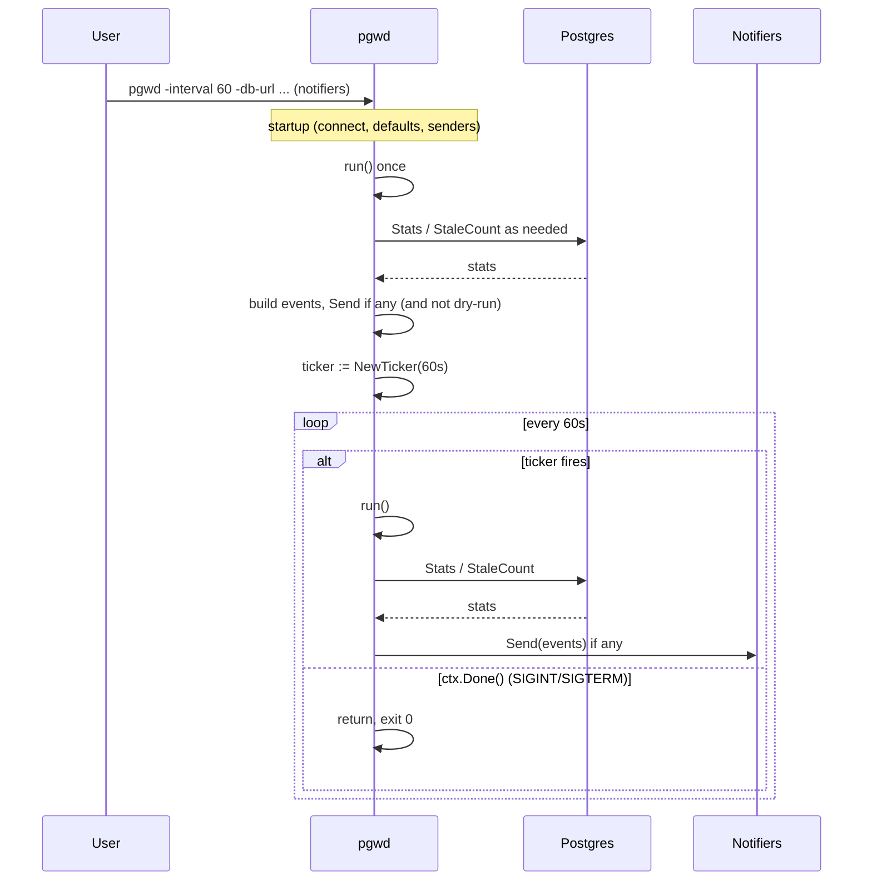

# Sequence: Daemon mode — ticker loop

With `-interval N` (N > 0): run once immediately, then every N seconds until SIGINT/SIGTERM.

```mermaid
sequenceDiagram
    participant User
    participant pgwd
    participant Postgres
    participant Notifiers

    User->>pgwd: pgwd -interval 60 -db-url ... (notifiers)
    Note over pgwd: startup (connect, defaults, senders)
    pgwd->>pgwd: run() once
    pgwd->>Postgres: Stats / StaleCount as needed
    Postgres-->>pgwd: stats
    pgwd->>pgwd: build events, Send if any (and not dry-run)
    pgwd->>pgwd: ticker := NewTicker(60s)
    loop every 60s
        alt ticker fires
            pgwd->>pgwd: run()
            pgwd->>Postgres: Stats / StaleCount
            Postgres-->>pgwd: stats
            pgwd->>Notifiers: Send(events) if any
        else ctx.Done() (SIGINT/SIGTERM)
            pgwd->>pgwd: return, exit 0
        end
    end
```
