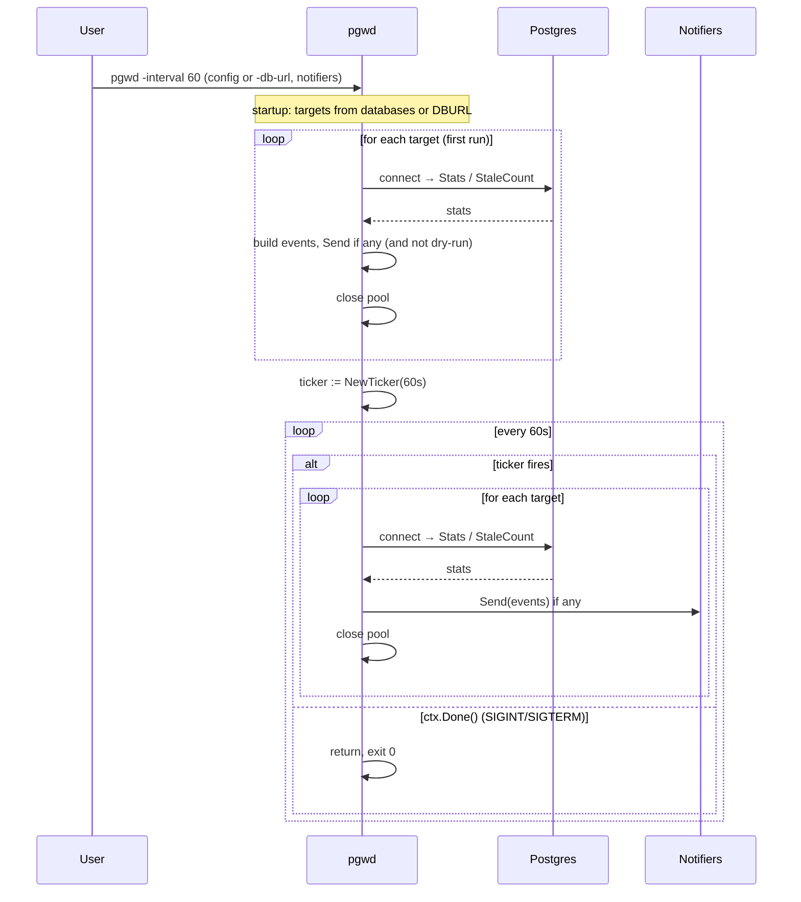

# Sequence: Daemon mode — ticker loop

With `-interval N` (N > 0): run once immediately, then every N seconds until SIGINT/SIGTERM. Targets come from config `databases:` or single `-db-url` (env). Each tick: loop over targets, connect → check → close.

