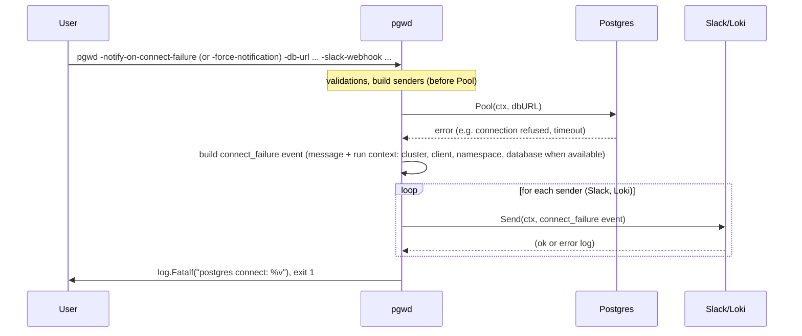

# Sequence: Connection failure — send alert and exit

When Postgres connection fails and `-notify-on-connect-failure` or `-force-notification` is set (with at least one notifier), pgwd sends a connect-failure event to Slack and/or Loki before exiting. Use this to get an infrastructure alert when the database is unreachable.

**Slack:** connect_failure is sent with attachment color `danger` (red bar). Threshold-exceeded events use `warning` (yellow bar).

**See also:** [01-startup-validation](./01-startup-validation.md) (startup flow including this failure path).
